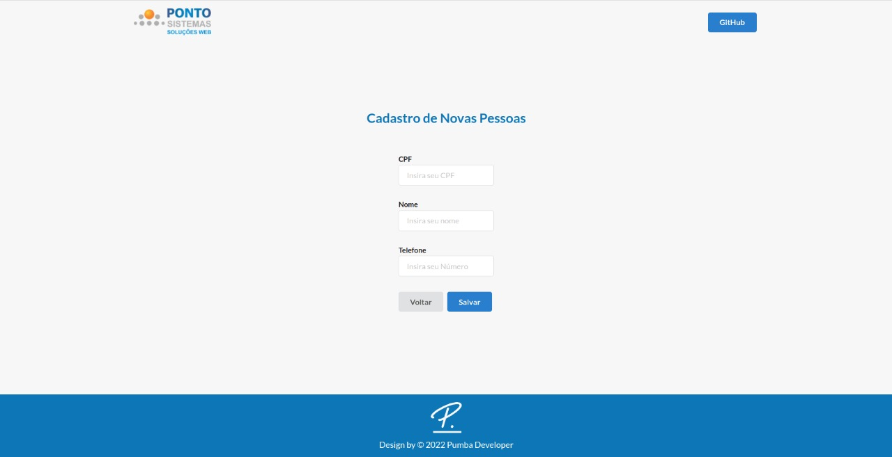

# 




> https://ponto-sistemas-teste.herokuapp.com/ - Página Web Vue 3 Desenvolvida como Teste Front-End.

<br>

### Ajustes e melhorias

O projeto ainda está em desenvolvimento e as próximas atualizações serão voltadas nas seguintes tarefas:

- [x] Configurar Ambiente de Desenvolvimento.
- [x] Levantar Requisitos e Assets do Projeto.
- [x] Configurar SemanticUI.
- [x] Configurar Rotas.
- [x] API com Firebase.
- [x] Cabeçalho da Página.
- [x] Tela de Cadastro.
- [x] Tela de Listagem.
- [x] Tela de Atualizar Usuário.
- [x] Botão de Editar Usuário.
- [x] PopUP de Edição de Usuário.
- [x] Botão de Apagar Usuário.
- [x] Confirmação para Apagar Usuário.
- [x] Rodapé da Página.
- [x] Responsividade.

## 📝 Pré-requisitos

Requisitos definidos pela empresa:

- Implementar Cadastro de Pessoas para Locadora Local.
- Página de Cadastro de Novas Pessoas (*/nova-pessoa*)
- Página de Listagem, Edição e Exclusão de Pessoas Cadastradas (*/lista-pessoas*).
- No Formulário de Inclusão o Botão **Salvar** deve Incluir e Redirecionar para Página de Listagem.
- No Formulário de Inclusão deve ter um botão **Voltar** Que Redireciona para a Página de Listagem.
- No Formulário de Listagem, Deve haver um Botão **Incluir** que Redireciona para a Página de Cadastro.
- Utilizar Biblioteca de Componentes SemanticUI
    - https://react.semantic-ui.com;


## ⚙️ Instalando o Projeto
Siga estas etapas:

```
npm install

npm run dev
```

## 💻 Feito Com:


## 🤝 Desenvolvido Por

<table>
  <tr>
    <td align="center">
      <a href="https://github.com/pumba-dev">
        <br>
        <sub>
          <b>Eu Mesmo</b>
        </sub>
      </a>
    </td>
  </tr>
</table>

[](https://www.linkedin.com/in/pumba-dev/)


## 😄 Seja um dos Contribuidores<br>

Entre em contato para se tornar um contribuidor.

## 💰 Donate

[](https://picpay.me/pumbadev)
[](https://nubank.com.br/pagar/1ou9f/ifu2K7YNO7)

## 📝 Licença

Copyright © 2022 Pumba Developer
